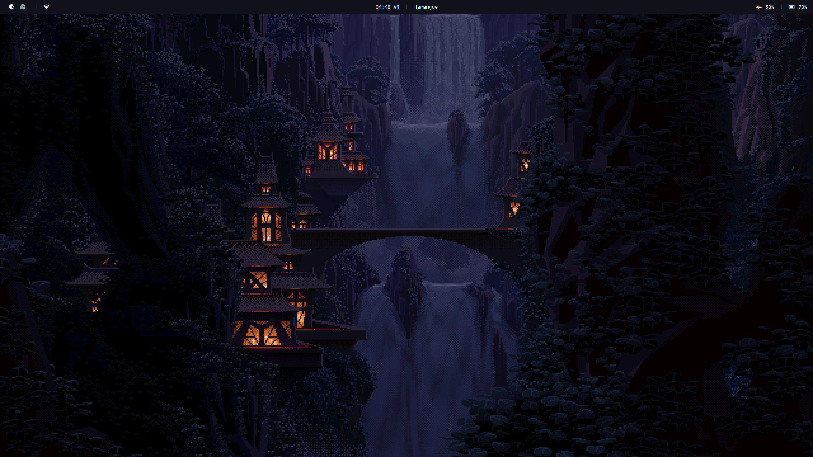
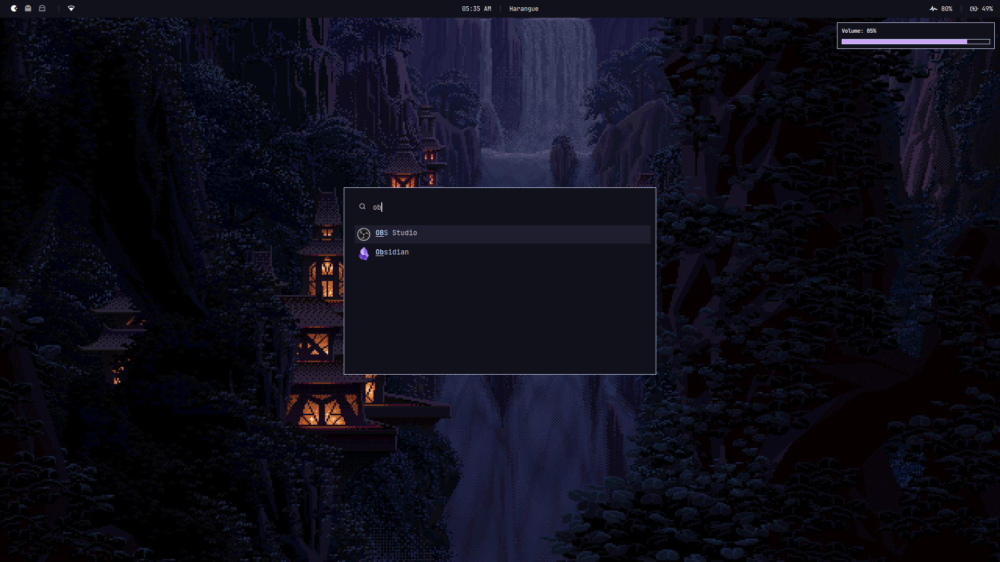
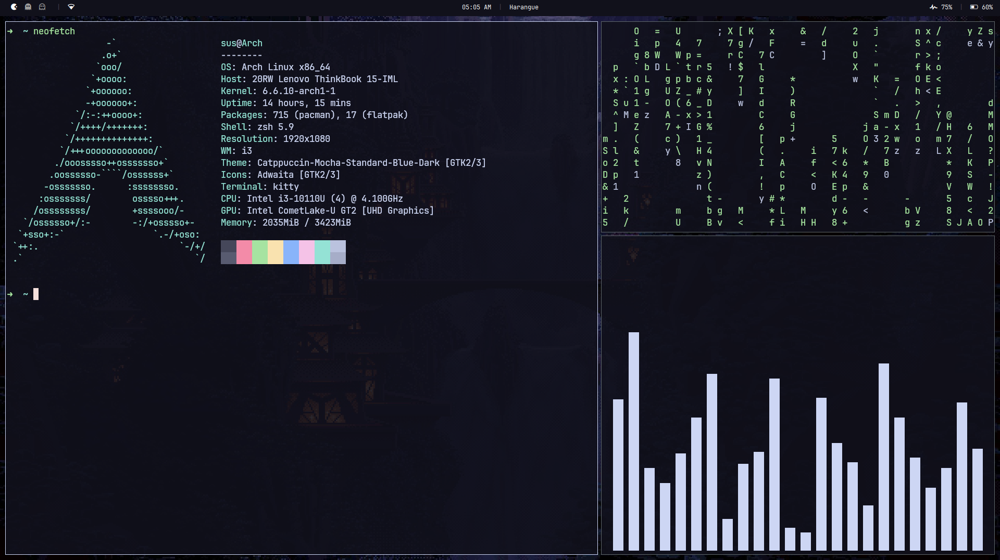

# ✨ My minimal catppuccin mocha riced config

## ⚡ Info

- Window manager - [i3](https://i3wm.org/)
- Compositor - [picom](https://github.com/yshui/picom)
- Text editor - [neovim](https://github.com/neovim/neovim)
- Launcher - [rofi](https://github.com/davatorium/rofi)
- Notification daemon - [dunst](https://github.com/dunst-project/dunst)
- Terminal - [kitty](https://github.com/kovidgoyal/kitty) with [tmux](https://github.com/tmux/tmux)

## 📸 Screenshots

